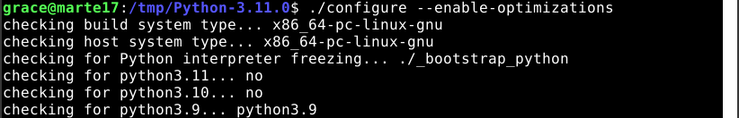
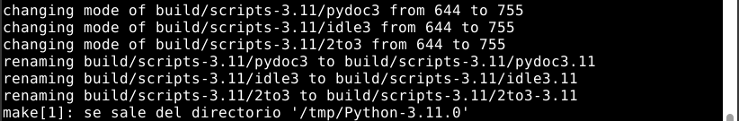

# Instalación de Python


<div align="center">
  
</div>

Para comenzar con la instalación de Python deberemos actualizar los repositorios

```
sudo apt update
```

<div align="center">
  
</div>

Instalamos algunos prerrequisitos:

```
sudo apt install -y build-essential zlib1g-dev libncurses5-dev \
libgdbm-dev libnss3-dev libssl-dev libreadline-dev libffi-dev \
libsqlite3-dev wget libbz2-dev
```

<div align="center">
  
</div>

Descargamos la versión `3.11.0` de Python. Al finalizar la descarga veremos algo así:

```
curl https://www.python.org/ftp/python/3.11.0/Python-3.11.0.tgz | tar xvz -C /tmp &&
cd /tmp/Python-3.11.0
```
<div align="center">
  
</div>

Configuramos para la futura instalación:

```
./configure --enable-optimizations
```

<div align="center">
  
</div>

Hacemos un make para compilar el intérprete y al finalizar se verá como en la imagen:

```
make -j `nproc`
```
<div align="center">
  
</div>

Ejecutamos la instalación y al finalizar veremos algo como lo siguiente:

```
sudo make altinstall
```
<div align="center">
  
</div>

Hacemos la versión `3.11.10` como la versión por defecto de Python

```
sudo update-alternatives --install /usr/bin/python python /usr/local/bin/python3.11 10
```

<div align="center">
  
</div>

Comprobamos la versión para asegurarnos que se ha instalado correctamente.

```
python --version
```

<div align="center">
  
</div>


## Instalación de paquetes

Comprobamos que tenemos la última versión del instalador de paquetes:

```
python -m pip install -U pip
```

<div align="center">
  
</div>

Para evitarnos escribir todo el tiempo `python -m pip` crearé un alias llamado `pip` que lo contenga:

```
alias pip=”python -m pip”
```

<div align="center">
  
</div>

Instalamos los paquetes de `black`, `iPython`, `wheel` y `cowsay`

```
pip install black ipython wheel cowsay
```

<div align="center">
  
</div>

Para comprobar que se ha instalado `cowsay` hacemos lo siguiente para ver a una vaca dándonos el mensaje de `Genial` mensaje:

```
python -c 'import cowsay; cowsay.cow("Genial")'
```
<div align="center">
  
</div>